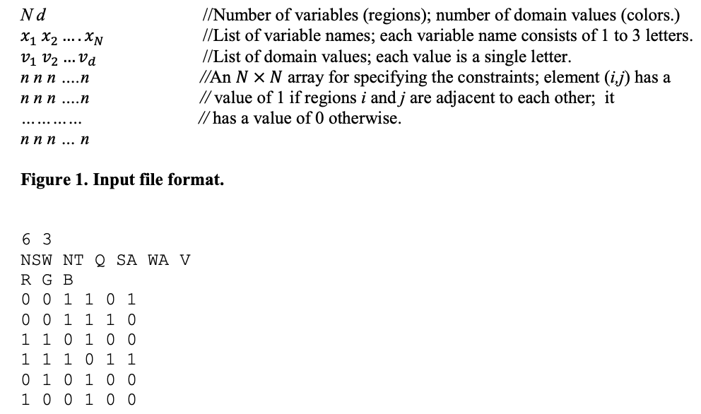

# Project Title

Map-Coloring Problem: AI solution

## Description

### Definiion

The Map-Coloring Problem is a practical Constraint-Satisfaction Problem (CSP). The problem
represents a map of Australia with several regions. Each region has a domain of three colors
it could possibly be colored. 

### Unassigned Region Selection

I implemented a backtracking algorithm with several other functions 
to recursively satisfy the constraints. One function is used to choose the next region to color
and it uses two heuristics: Minimum Remaining Values (MRV) and Degree heuristics. MRV chooses the 
variable with the fewest legal values left. If there are multiple variables (regions) of the same number
the function moves on to the degree heuristic where the variable with the most unassigned neighbors is
chosen. If there is still not one definite variable chosen, the program chooses a random variable.

### Backtracking with Inference

Another function chooses what color a region can be by checking its neighbors to see if a color is valid.
After a color is chosen, the inference function is ran which goes through the recently assigned region's
neighbors and removes the color just assigned as a possibility for them. If every color for each of the
region's neighbors is removed from being a possibility then there is no solution for the CSP, otherwise
the recursive backtracking fucntion continues until a final solution is found.


## Getting Started

### Dependencies

* Install Python3


### Installing

* Download file to desired local directory
* Create python3 virtual environemnt in desired local directory using following command:
```
python3 -m venv 'name'
```
* Create subdirectory where file will go
* Download file to subdirectory

### Executing program

* To run program
```
python3 AIfinalproject.py
```
* Provide an input file named "input1.txt" in the same directory as the python file.
* Format it as such:



## Author

* Dustin Jasmin 
* [mailto](mailto:jasmindustin@gmail.com)
